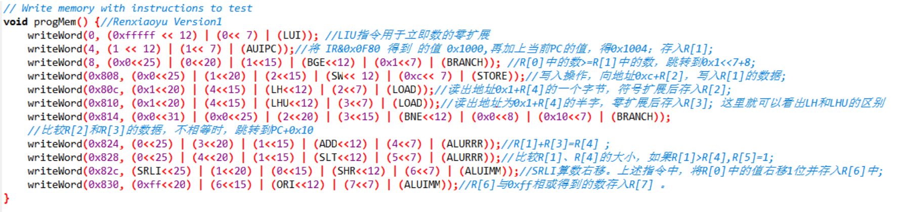

# 实验报告

## 实验名称（RISC-V基本指令集模拟器设计与实现）

班级：智能1602 学号：201608010627 姓名：任小禹

## 实验目标

设计一个CPU模拟器，能模拟CPU指令集的功能。

## 实验要求

* 采用C/C++编写程序
* 模拟器的输入是二进制的机器指令文件
* 模拟器的输出是CPU各个寄存器的状态和相关的存储器单元状态

## 实验内容

### CPU指令集

CPU的指令集请见[这里](https://riscv.org/specifications/)，其中基本指令集共有47条指令。

### 模拟器程序框架

考虑到CPU执行指令的流程为：

1. 取指
2. 译码
3. 执行（包括运算和结果写回）

对模拟器程序的框架设计如下：

```C++
while(1) {
    inst = fetch(cpu.pc);
    cpu.pc = cpu.pc + 4;
    
    inst.decode();
    
    switch(inst.opcode) {
        case LUI:
				cout << "Do LUI" << endl;
				R[rd] = Imm31_12UtypeZeroFilled;
				break;
		case AUIPC:
				cout << "Do AUIPC" << endl;
				cout << "PC = " << PC << endl;
				cout << "Imm31_12UtypeZeroFilled = " << Imm31_12UtypeZeroFilled << endl;
				R[rd] = PC + Imm31_12UtypeZeroFilled;
				break;
        case BRANCH:
                switch(funct3) {
					case BNE:
						cout << "Do BNE " << endl;
						if(src1!=src2){
							NextPC = PC + Imm12_1BtypeSignExtended;
						}
						break;
					default:
						cout << "ERROR: Unknown funct3 in BRANCH instruction " << IR << endl;
				}
				break;
         case LOAD:
				switch(funct3) {
					case LH:
						cout << "Do LH " << endl;
						unsigned int temp_LH,temp_LH_UP;
						temp_LH=readHalfWord(src1+Imm11_0ItypeSignExtended);
						temp_LH_UP=temp_LH>>15;
						if(temp_LH_UP==1){
							temp_LH=0xffff0000 | temp_LH;
						}else{
							temp_LH=0x0000ffff & temp_LH;
						}
						R[rd]=temp_LH; 
						break;
					default:
						cout << "ERROR: Unknown funct3 in LOAD instruction " << IR << endl;
				}
				break;
        case ALUIMM:
				switch(funct3) {
					case ADDI:
						cout <<    "Do ADDI" << endl;
						R[rd]=src1+Imm11_0ItypeSignExtended;
						break;
					case SLLI:
						cout << "Do SLLI " << endl;
						R[rd]=src1<<shamt;
						break；
					default:
						cout << "ERROR: Unknown funct3 in ALUIMM instruction " << IR << endl;
				}
				break;
        case ALURRR:
				switch(funct3) {
					case SLT:
						cout << "Do SLT " << endl;
						if((int)src1<(int)src2){
							R[rd]=1;
						}else{
							R[rd]=0;
						}
						break;
					default:
						cout << "ERROR: Unknown funct3 in ALURRR instruction " << IR << endl;
				}
				break;
        default:
            cout << "无法识别的操作码：” << inst.opcode;
    }
}
```

其中while循环条件可以根据需要改为模拟终止条件。

在模拟器程序里面添加了测试程序,详情如下：


指令详情见注释。

## 测试

### 测试平台

模拟器在如下机器上进行了测试：

| 部件     | 配置             | 备注   |
| :--------|:----------------:| :-----:|
| CPU      | core i7-8750U    |        |
| 内存     | DDR3 8GB         |        |
| 操作系统 | windows 10 | 中文版 |

### 测试记录

### 测试记录

模拟器运行过程的截图如下：

##### 第一条指令LUI运行后模拟器的输出


LIU指令用于立即数的零扩展,这里放立即数到rd的高20位，低12位置0。上述指令中立即数为fffff，存入R[0]，存入的数为fffff000。
##### 第二条指令AUIPC运行后模拟器的输出


 AUIPC指令将IR&0x0F80 得到的值 0x1000,再加上当前PC的值，得0x1004，存入R[1]。 
##### 第三条指令BGE运行后模拟器的输出


BGE指令如果R[0]中的数>=R[1]中的数，跳转到0x808(0x1<<7+8)

##### 第四条指令SW运行后模拟器的输出


SW写入操作，向地址0xc+R[2]，写入R[1]的数据，即1004
##### 第五条指令LH运行后模拟器的输出


读出地址0x1+R[4]，即0x1的一个字节，符号扩展后存入R[2]，R[2]为0xfffffff0
## 分析和结论

从测试记录来看，模拟器实现了对二进制指令的读入，指令功能的模拟，CPU和存储器状态的输出。

根据分析结果，可以认为编写的模拟器实现了所要求的功能，完成了实验目标。
